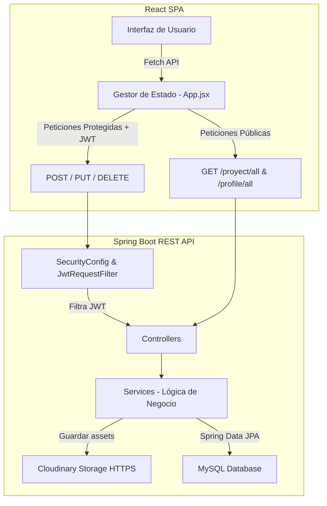

# 🚀 Portfolio Web Full Stack (SPA + API REST)

> **Una SPA (Single Page Application) moderna, interactiva y con panel de administración autogestionable (CMS), construida con una arquitectura desacoplada.**

[](https://www.oracle.com/java/)
[](https://spring.io/projects/spring-boot)
[](https://spring.io/projects/spring-security)
[](https://react.dev/)
[](https://www.mysql.com/)
[](https://cloudinary.com/)
[](https://junit.org/junit5/)

Este proyecto es mi portafolio profesional. A diferencia de un sitio estático tradicional, es un sistema **Full Stack autogestionable** donde la información del perfil y los proyectos expuestos se administran dinámicamente desde un panel de control interactivo protegido por seguridad JWT.

---

## 💎 Características Principales

*   **Panel de Administración Integrado (Inline CMS):** Los administradores pueden iniciar sesión mediante un enlace discreto en el pie de página (`• Admin`) para editar textos, subir imágenes o eliminar proyectos directamente desde la interfaz de la web mediante ventanas modales interactivas.
*   **Seguridad Robustecida con JWT:** Implementación de **Spring Security 6** y tokens **JSON Web Tokens (JWT)**. Las rutas de lectura son públicas, mientras que las de modificación (POST, PUT, DELETE) están estrictamente restringidas a peticiones autenticadas.
*   **Almacenamiento Seguro (HTTPS Cloudinary):** Subida asíncrona de archivos (CV, fotos de perfil, capturas de proyectos) a Cloudinary, forzando enlaces seguros con protocolo HTTPS para evitar problemas de contenido mixto (Mixed Content).
*   **Diseño Premium & Totalmente Responsivo:** Estética cuidada con fuentes modernas, efectos de desenfoque de fondo (*glassmorphism*), transiciones fluidas y adaptabilidad total desde pantallas de teléfonos móviles hasta portátiles y monitores de alta resolución.
*   **Suite de Pruebas Unitarias:** Cobertura de tests unitarios en la capa de servicios con JUnit 5 y Mockito, usando una base de datos en memoria **H2** para asegurar que el código sea testeable de forma aislada en cualquier entorno de integración continua.

---

## 🏗️ Arquitectura de Software

El sistema sigue un modelo desacoplado **Cliente-Servidor**:



---

## 🛠️ Estructura del Proyecto

*   `/portfolio_backend`: API REST construida con Spring Boot 3 y Maven. Contiene la lógica, persistencia, enrutamiento y filtros de seguridad.
*   `/portfolio_frontend`: Aplicación cliente creada con React, Vite y CSS Vanilla para un rendimiento y flexibilidad excepcionales.

---

## 🔒 Buenas Prácticas de Seguridad Aplicadas

Para garantizar que el repositorio público sea seguro y profesional:
*   **Cero Credenciales en Código:** Las contraseñas de la base de datos MySQL, credenciales de Cloudinary y la clave secreta para la firma de tokens JWT (`jwt.secret`) se cargan dinámicamente mediante **variables de entorno** en el servidor de producción (Render).
*   **Sembrado Automático (AdminSeeder):** Al levantar la aplicación en producción por primera vez, el backend crea un usuario administrador por defecto de forma segura si la tabla de usuarios se encuentra vacía.
*   **Contraseñas Encriptadas:** La contraseña del administrador se almacena en la base de datos MySQL utilizando el algoritmo de hash **BCrypt** (`BCryptPasswordEncoder`).

---

## 🧪 Pruebas y Calidad de Código

El backend cuenta con una suite completa de pruebas automatizadas:
*   **Tests de Integración de Contexto:** Valida que el contenedor de Spring Boot inicie correctamente simulando la capa de base de datos con **H2**.
*   **Tests Unitarios:** Mockean los repositorios y servicios externos (Cloudinary) con Mockito para validar las reglas de negocio de creación, edición y borrado de perfiles y proyectos de forma aislada.

Para ejecutar los tests en local:
```bash
cd portfolio_backend
./mvnw clean test
```

---

## 🚀 Despliegue (Deployment)

*   **Backend:** Alojado en **Render** dentro de un contenedor Docker, conectado a una base de datos MySQL gestionada en la nube.
*   **Frontend:** Compilado para producción con Vite y desplegado en servidores optimizados de alojamiento estático.
